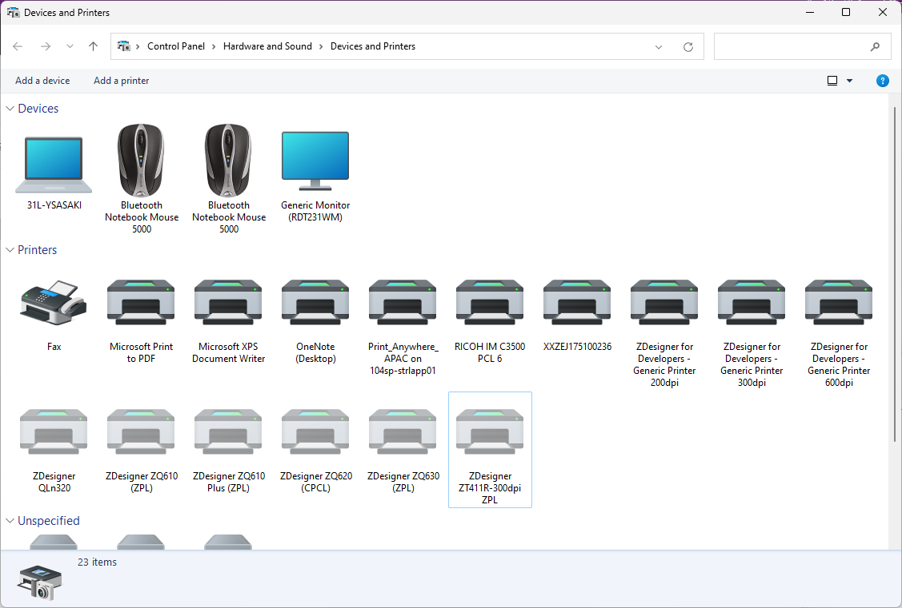
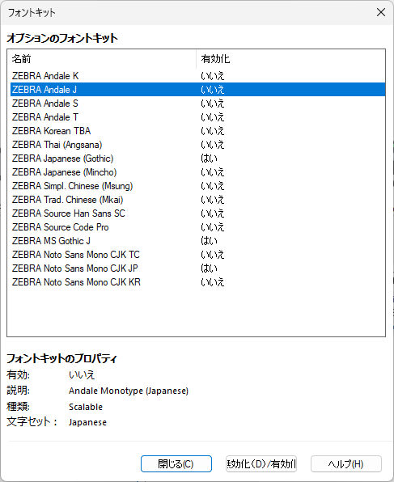
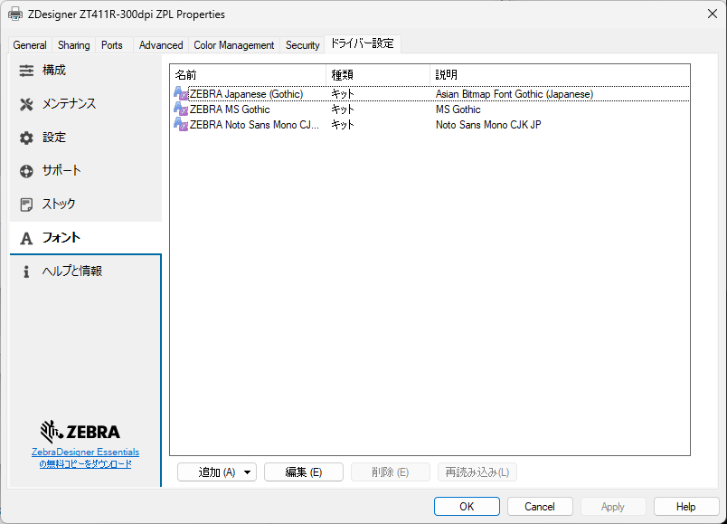
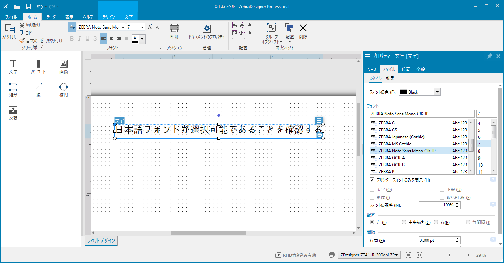

## Zebra Designer 3でプリンタ内蔵の日本語フォントを利用する方法

Zebra Designer 3（以降ZD3）にてプリンタ内蔵のフォントを利用したいことがあるかと思います。その簡単ガイドを下記に列記します。

1. [デバイスとプリンタ]を開く。

 
1. 送信先プリンタを右クリック > [Printer Propaties]を選択。
 
1. [ドライバ設定]タブ > [フォント] >を選択。
 
1. [追加] > [キット]を選択。

 
1. 該当のプリンタにインストール済みのフォントを「有効化」する。

 
1. ［フォントキット］画面を閉じる。
 
1. 有効化したフォントを確認し、［OK］を選択する。

 

1. ZD3を起動し、設定したドライバを選択し、有効化したフォントが利用可能であることを確認する。

 

End